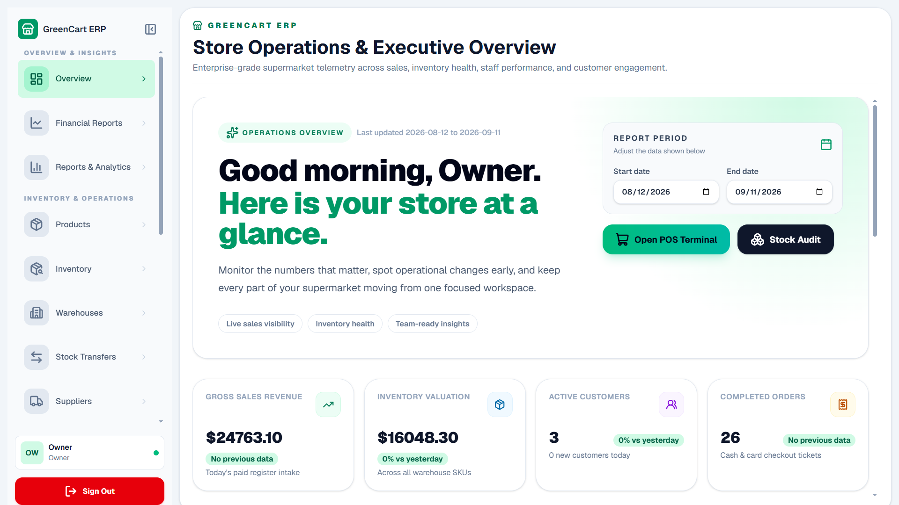
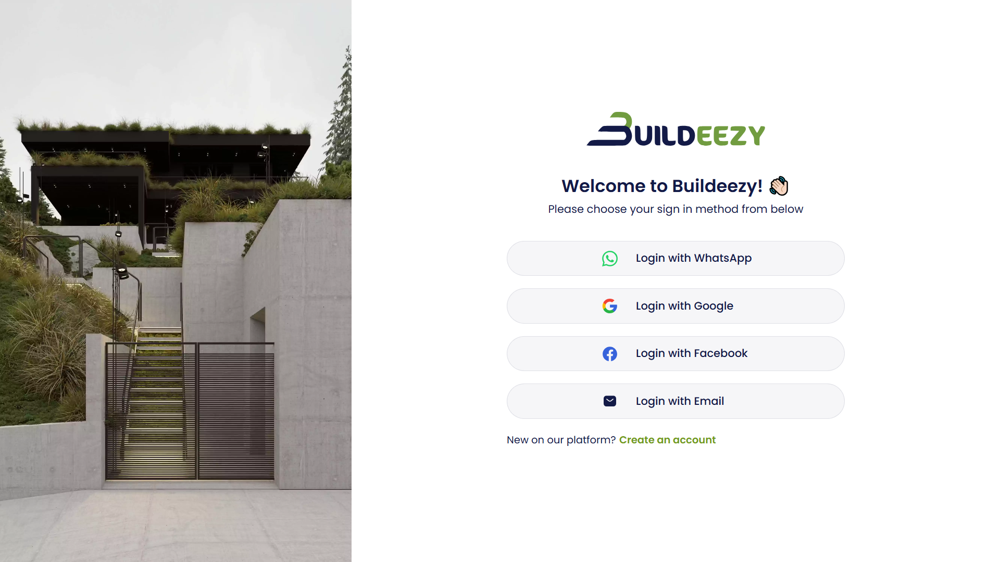
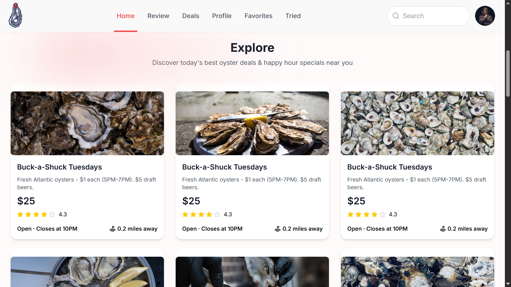
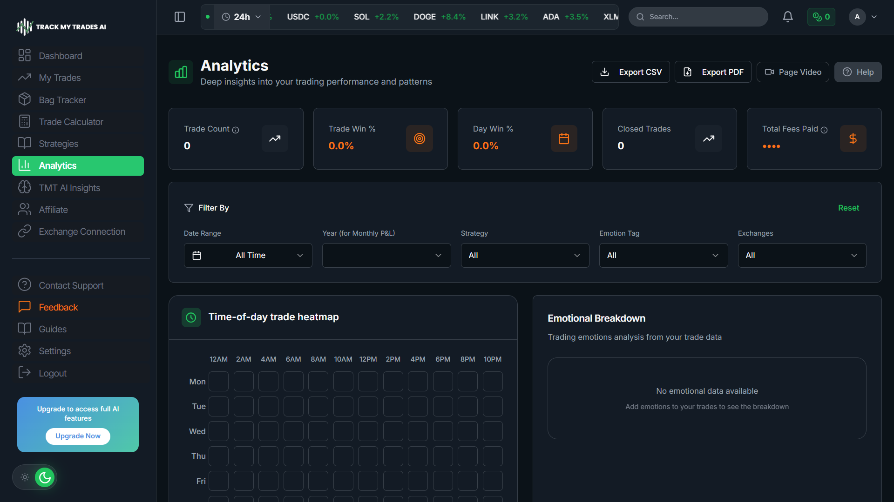

<!-- ================= HEADER ================= -->

 

 

<!-- ================= ABOUT ================= -->
## 👋 About Me

I'm a **Full Stack MERN Developer** who builds fast, production-ready web applications end-to-end — from database schema to deployed, SEO-optimized UI.

- 🔭 Building with **React, Next.js, TypeScript, Node.js, Express, MongoDB, PostgreSQL & Supabase**
- 🔍 Strong focus on **SEO, Core Web Vitals & performance-first architecture**
- 🎓 Final-year **BS Computer Science** student at Punjab University
- 💼 Hands-on experience shipping real products at **Alpha Hive AI** and **Uptech Sol**
- 🤖 Comfortable working AI-native — **Claude, Cursor, GitHub Copilot, OpenAI Codex & Lovable** are part of my daily workflow
- 🎯 Actively looking for **Full Stack / MERN / Next.js / TypeScript** roles
- ⚡ Fun fact: I care as much about clean architecture as I do about clean UI

 

<!-- ================= TECH STACK ================= -->
## 🛠️ Tech Stack

<table>
<tr>
<td valign="top" width="50%">

**Frontend**

</td>
<td valign="top" width="50%">

**Backend & Database**

</td>
</tr>
<tr>
<td valign="top" width="50%">

**Tools & DevOps**

</td>
<td valign="top" width="50%">

**Growth & Analytics**

 GA4 · GTM · SEO · Event Tracking

</td>
</tr>
</table>

 

**AI-Assisted Development**

 

<!-- ================= WHAT I BUILD ================= -->
## 🚀 What I Build

| Category | Focus |
|---|---|
| 🖥️ **Full Stack Apps** | MERN-based SaaS and web platforms, built API-first |
| 🛒 **E-Commerce Systems** | Cart, checkout, and payment-integrated storefronts |
| 📊 **Analytics Dashboards** | Real-time data visualization with tracking pipelines |
| 🔍 **SEO-Optimized Sites** | Server-rendered, performance-tuned, crawlable by design |
| 📈 **Conversion Tracking** | GA4 + GTM funnels wired into product decisions |

 

<!-- ================= PROJECTS ================= -->
## 🧩 Featured Projects

<table>
<tr>
<td width="50%">

**GreenCart Market** — SaaS Storefront
 

 
Modern supermarket landing page — hero, department navigation, and store-onboarding flow.
 
<a href="https://supermarketerp.vercel.app/">Live Demo</a>

</td>
<td width="50%">

**GreenCart ERP** — Admin Dashboard
 

 
Store operations dashboard — sales, inventory valuation, POS terminal, and stock audit tools.
 
<a href="https://supermarketerp.vercel.app/">Live Demo</a>

</td>
</tr>
<tr>
<td width="50%">

**Buildeezy** — Auth & Onboarding
 

 
Multi-provider sign-in flow (WhatsApp, Google, Facebook, Email) for a construction/marketplace platform.
 
<a href="https://app.buildeezy.com/">Live Demo</a>

</td>
<td width="50%">

**Oyster Deals Explorer** — Discovery App
 

 
Local deals discovery app with reviews, ratings, and real-time happy-hour listings.
 
<a href="https://oyster-web.vercel.app/">Live Demo</a>

</td>
</tr>
<tr>
<td width="50%">

**Track My Trades AI** — Crypto Analytics Platform
 

 
AI-powered trading dashboard — trade analytics, time-of-day heatmaps, emotional breakdown, and performance insights.
 
<a href="https://trackmytrades.ai/">Live Demo</a>

</td>
<td width="50%"></td>
</tr>
</table>

 

<!-- ================= CONNECT ================= -->
## 🤝 Let's Connect

  

<b>Build. Optimize. Scale.</b>

